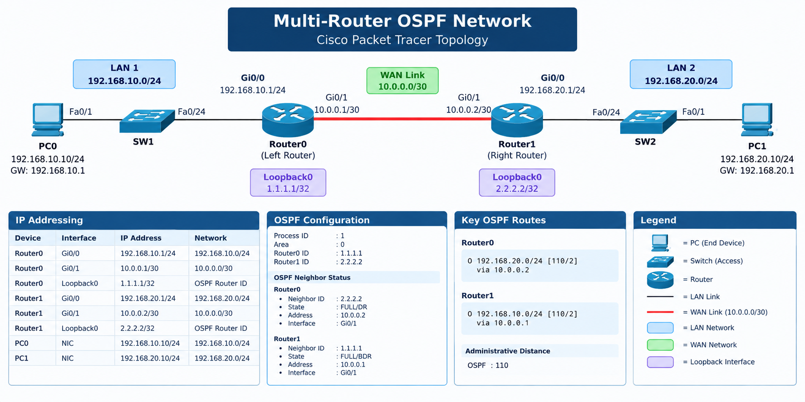

# Multi-Router OSPF Network

A Cisco Packet Tracer networking project demonstrating multi-router connectivity, OSPF dynamic routing, routing verification, troubleshooting, and network documentation.

## Project Overview

This project was built to develop practical networking skills using Cisco Packet Tracer.

The network consists of two routers connecting two separate LANs. OSPF is used as the dynamic routing protocol between the routers.

The project also includes hands-on troubleshooting incidents involving interface failures, routing-table changes, and end-to-end connectivity testing.

## Topology



The network consists of two separate LANs connected through **Router0** and **Router1** using an OSPF Area 0 WAN link.

### Network Structure

| Network  | Address           | Purpose           |
| -------- | ----------------- | ----------------- |
| LAN 1    | `192.168.10.0/24` | PC0 network       |
| WAN Link | `10.0.0.0/30`     | Router0 ↔ Router1 |
| LAN 2    | `192.168.20.0/24` | PC1 network       |

### Device Path

```text
PC0 ── SW1 ── Router0 ───── Router1 ── SW2 ── PC1
       LAN      R1             R2       LAN
```

### Router Interfaces

**Router0**

| Interface            | IP Address        | Network |
| -------------------- | ----------------- | ------- |
| `GigabitEthernet0/0` | `192.168.10.1/24` | LAN 1   |
| `GigabitEthernet0/1` | `10.0.0.1/30`     | WAN     |

**Router1**

| Interface            | IP Address        | Network |
| -------------------- | ----------------- | ------- |
| `GigabitEthernet0/0` | `192.168.20.1/24` | LAN 2   |
| `GigabitEthernet0/1` | `10.0.0.2/30`     | WAN     |

### OSPF Configuration

* **Routing Protocol:** OSPF
* **OSPF Process ID:** `1`
* **Area:** `0`
* **Router0 Router ID:** `192.168.10.1`
* **Router1 Router ID:** `192.168.20.1`

OSPF dynamically exchanges routing information between Router0 and Router1, allowing devices on **LAN 1** and **LAN 2** to communicate with each other.


## Devices

| Device  | Role                     |
| ------- | ------------------------ |
| Router0 | Left-side LAN router     |
| Router1 | Right-side LAN router    |
| SW1     | Left-side access switch  |
| SW2     | Right-side access switch |
| PC0     | Left-side client         |
| PC1     | Right-side client        |

## IP Addressing

| Device  | Interface | IP Address       | Network         |
| ------- | --------- | ---------------- | --------------- |
| Router0 | Gi0/0     | 192.168.10.1/24  | 192.168.10.0/24 |
| Router0 | Gi0/1     | 10.0.0.1/30      | 10.0.0.0/30     |
| Router0 | Loopback0 | 1.1.1.1/32       | OSPF Router ID  |
| Router1 | Gi0/0     | 192.168.20.1/24  | 192.168.20.0/24 |
| Router1 | Gi0/1     | 10.0.0.2/30      | 10.0.0.0/30     |
| Router1 | Loopback0 | 2.2.2.2/32       | OSPF Router ID  |
| PC0     | NIC       | 192.168.10.10/24 | 192.168.10.0/24 |
| PC1     | NIC       | 192.168.20.10/24 | 192.168.20.0/24 |

## Routing Protocol

### OSPF

OSPF is configured using:

* Process ID: `1`
* Area: `0`
* Router0 Router ID: `1.1.1.1`
* Router1 Router ID: `2.2.2.2`

The routers form an OSPF adjacency across the `10.0.0.0/30` WAN link.

### OSPF Neighbor Relationship

Router0:

```text
Neighbor ID: 2.2.2.2
State: FULL/DR
Address: 10.0.0.2
Interface: GigabitEthernet0/1
```

Router1:

```text
Neighbor ID: 1.1.1.1
State: FULL/BDR
Address: 10.0.0.1
Interface: GigabitEthernet0/1
```

## OSPF Routes

Router0 learns the remote LAN through OSPF:

```text
O 192.168.20.0/24 [110/2] via 10.0.0.2
```

Router1 learns the remote LAN through OSPF:

```text
O 192.168.10.0/24 [110/2] via 10.0.0.1
```

The administrative distance for OSPF is `110`.

## Passive Interfaces

The LAN interfaces are configured as passive OSPF interfaces.

This prevents unnecessary OSPF neighbor formation toward end-user LANs while still allowing the LAN networks to be advertised.

The router-to-router interfaces remain active for OSPF adjacency formation.

## Verification

The following commands were used to verify the network:

```text
show ip interface brief
show ip ospf neighbor
show ip route
show ip route ospf
show ip protocols
show ip ospf interface
show ip ospf database
show arp
ping
```

### End-to-End Connectivity

PC0 successfully reaches PC1:

```text
PC0 → 192.168.20.10
Packets: Sent = 4
Received = 4
Lost = 0
```

PC1 successfully reaches PC0:

```text
PC1 → 192.168.10.10
Packets: Sent = 4
Received = 4
Lost = 0
```

## OSPF Cost Experiment

An OSPF interface cost was temporarily modified during the lab to understand how OSPF calculates path metrics.

For example:

```text
ip ospf cost 50
```

The route metric changed accordingly.

After testing, the manual cost was removed and the interface returned to its normal cost.

This demonstrated the difference between:

* OSPF administrative distance
* OSPF interface cost
* Total OSPF path metric

## Troubleshooting

Three troubleshooting incidents were documented.

### Incident 1 — OSPF Interface Down

Investigated an OSPF connectivity problem caused by an administratively down router interface.

Documentation:

[`incident-01-ospf-interface-down.md`](troubleshooting/incident-01-ospf-interface-down.md)

### Incident 2 — Intermittent First-Ping Loss

Investigated an initial ping failure and determined that there was no persistent network fault. The behavior was consistent with normal ARP resolution.

Documentation:

[`incident-02-intermittent-ping.md`](troubleshooting/incident-02-intermittent-ping.md)

### Incident 3 — Remote LAN Unreachable

Investigated a complete loss of connectivity to the remote LAN.

The root cause was an administratively shut down Router1 LAN interface:

```text
GigabitEthernet0/0
192.168.20.1
administratively down
```

The interface was restored using:

```text
interface gigabitEthernet0/0
no shutdown
```

OSPF then relearned the remote network and end-to-end connectivity was restored.

Documentation:

[`incident-03-remote-lan-unreachable.md`](troubleshooting/incident-03-remote-lan-unreachable.md)

## Configuration Files

Final router configurations are available here:

* [Router0 Configuration](configs/router0-config.txt)
* [Router1 Configuration](configs/router1-config.txt)

## Packet Tracer File

The Cisco Packet Tracer project file is included in this repository:

`multi-router-ospf.pkt`

## Skills Demonstrated

* IPv4 addressing
* Subnetting
* Cisco IOS CLI
* Router configuration
* Static interface configuration
* OSPF
* OSPF Router IDs
* OSPF neighbor relationships
* OSPF LSAs and LSDB concepts
* OSPF cost and metrics
* Passive interfaces
* Routing-table analysis
* ARP troubleshooting
* End-to-end connectivity testing
* Network troubleshooting
* Technical documentation
* GitHub project documentation

## Key Lessons Learned

This project strengthened practical understanding of how routers exchange routing information and how to troubleshoot failures systematically.

Important lessons include:

1. A `FULL` OSPF adjacency does not guarantee that every expected network is available.
2. A connected network disappearing can cause its OSPF route to be withdrawn.
3. OSPF cost affects the routing metric.
4. Administrative distance and routing metric are different concepts.
5. Passive interfaces prevent unnecessary OSPF adjacency formation on user LANs.
6. ARP can affect the first packet of a connectivity test.
7. Troubleshooting should be based on evidence rather than assumptions.
8. End-to-end testing is essential after making a network change.

## Project Status

**Completed**

This project demonstrates a functional multi-router OSPF network with documented configuration, verification, and troubleshooting scenarios.

## Author

**Md. Hridoy Sheikh**

Computer Science & Engineering Student
Networking / Junior Network Engineer Career Path
